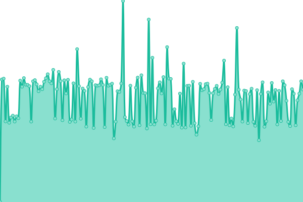
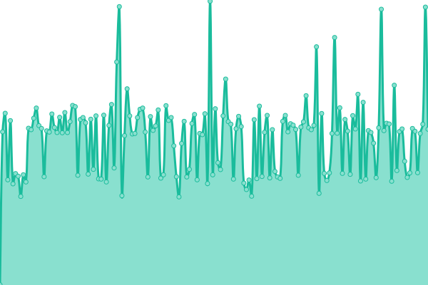
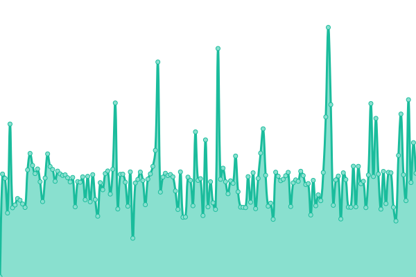

# [📈 Live Status](https://status.honk.ie): <!--live status--> **🟩 All systems operational**

This repository contains the open-source uptime monitor and status page for [jamiew0w](jamie.ie), powered by [Upptime](https://github.com/upptime/upptime).

With [Upptime](https://upptime.js.org), you can get your own unlimited and free uptime monitor and status page, powered entirely by a GitHub repository. We use [Issues](https://github.com/jamiew0w/status.honk.ie/issues) as incident reports, [Actions](https://github.com/jamiew0w/status.honk.ie/actions) as uptime monitors, and [Pages](https://status.honk.ie) for the status page.

<!--start: status pages-->
<!-- This summary is generated by Upptime (https://github.com/upptime/upptime) -->
<!-- Do not edit this manually, your changes will be overwritten -->
<!-- prettier-ignore -->
| URL | Status | History | Response Time | Uptime |
| --- | ------ | ------- | ------------- | ------ |
|  [honk.ie](https://honk.ie) | 🟩 Up | [honk-ie.yml](https://github.com/jamiew0w/status.honk.ie/commits/HEAD/history/honk-ie.yml) | 

 669ms
     
 | 

<a href="https://status.honk.ie/history/honk-ie">100.00%</a>
    

|  [plex.honk.ie](https://plex.honk.ie/web/index.html) | 🟩 Up | [plex-honk-ie.yml](https://github.com/jamiew0w/status.honk.ie/commits/HEAD/history/plex-honk-ie.yml) | 

 591ms
     
 | 

<a href="https://status.honk.ie/history/plex-honk-ie">100.00%</a>
    

|  [ombi.honk.ie](https://ombi.honk.ie) | 🟩 Up | [ombi-honk-ie.yml](https://github.com/jamiew0w/status.honk.ie/commits/HEAD/history/ombi-honk-ie.yml) | 

 659ms
     
 | 

<a href="https://status.honk.ie/history/ombi-honk-ie">100.00%</a>
    

|  [tautulli.honk.ie](https://tautulli.honk.ie/auth/login?redirect_uri=/) | 🟩 Up | [tautulli-honk-ie.yml](https://github.com/jamiew0w/status.honk.ie/commits/HEAD/history/tautulli-honk-ie.yml) | 

 617ms
     
 | 

<a href="https://status.honk.ie/history/tautulli-honk-ie">100.00%</a>
    

<!--end: status pages-->

[**Visit our status website →**](https://status.honk.ie)

## 📄 License

- Powered by: [Upptime](https://github.com/upptime/upptime)
- Code: [MIT](./LICENSE) © [jamiew0w](jamie.ie)
- Data in the `./history` directory: [Open Database License](https://opendatacommons.org/licenses/odbl/1-0/)
